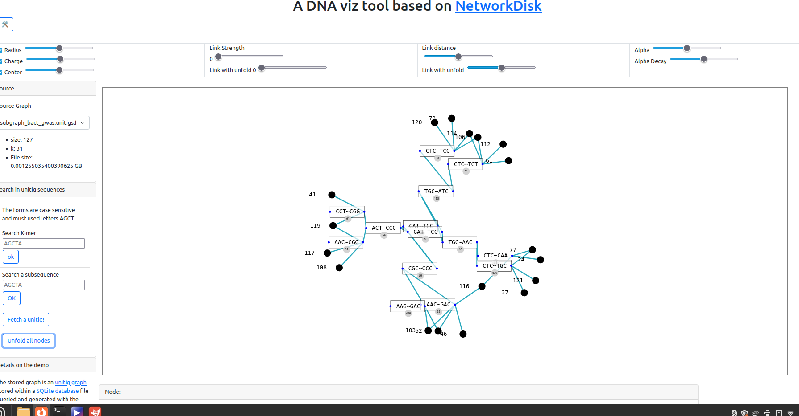

## Master Internship: Methods for quantifying gene expression with long reads

**Context**

Genes produce RNA in varying amounts at a given time, in a given individual, under given conditions (we refer to this as gene expression). In eukaryotes, genes can also produce more than one form of RNA (isoforms), which do not necessarily have the same expression levels. Differences in these expression levels, when compared between conditions, can generate biological hypotheses. For example, a gene that is almost dormant under certain conditions but highly expressed under another may be of interest. These form the basis for expression studies involving different biological conditions and replicates.

With Illumina's short reads, the state of the art is very well established. This involves querying the k-mers of the reads in RNA reference sequence databases, identifying the isoforms where the k-mers are found, and then using strategies to assign the k-mers when there are multiple assignments. Final counts can be listed at the isoform or gene level. This rapid strategy is called pseudo-alignment.

Long read sequencing (PacBio, Nanopore) also concerns RNAs, with an increasing number of methods for quantifying expression based on long reads. One advantage is that the length of the reads allows for less ambiguity when identifying corresponding isoforms. However, these reads are more error-prone than Illumina sequences, leading to the development of dedicated methods. Unlike short reads, long reads are aligned to a reference genome to quantify, an operation that is more costly than pseudo-counting, especially if repeated for multiple samples.

**Internship Objective**

We propose to test the opposite strategy, where sample reads are indexed in a structure developed in the laboratory, which will compress to reduce redundancy. The sequences of a reference transcriptome can then be queried to the index in a pseudo-mapping strategy to assign reads to isoforms. We can explore assignment strategies that achieve a time-memory trade-off, like chaining instead of "simple" pseudo-mapping. Finally, we'll add an expectation maximization algorithm, which already has known implementations for this issue, to distribute assigned reads.
The internship will thus be divided into a time for literature review, a period for development, and a benchmarking phase to validate the various solutions implemented.

**Internship Terms**

The internship is paid for a duration of 6 months, starting at the beginning of 2024. It is funded by the ANR JCJC Find-RNA, and may lead to a PhD in the fall of 2024. It will take place on the Cité Scientifique campus in Lille, in the CRIStAL laboratory. It is supervised by Camille Marchet (contact: replace "univ-lille.fr @ camille.marchet" with an obvious permutation), researcher in the BONSAI bioinformatics team.

**Candidate Profile**

While keeping an open mind to unusual applications, the typical profile remains that of a bioinformatician with a taste for methodological development and programming. Curious computer scientists and biologists are also welcome.

**References**

[short reads quantification with Salmon](https://www.nature.com/articles/nmeth.4197)

[short reads quantification with Kallisto](https://www.nature.com/articles/nbt.3519)

[long reads quantification with FLAIR](https://www.ncbi.nlm.nih.gov/pmc/articles/PMC7080807/)

[long reads quantification with Bambu](https://www.nature.com/articles/s41592-023-01908-w)

## Master Internship: Visualization and queries for biology in de Bruijn graphs

**Context**

This internship takes place in Lille University (campus cité Scientifique, Villeneuve d'Ascq), and will be co supervised by members of team [BONSAI](https://www.cristal.univ-lille.fr/bonsai/) (sequence bioinformatics, CRIStAL laboratory) and team [LINKS](https://team.inria.fr/links/fr/) (databases, logical queries, CRIStAL & Inria). 
It is funded by [ANR Full-RNA](https://anr.fr/Projet-ANR-22-CE45-0007) (ANR-22-CE45-0007).

The de Bruijn graph is a fundamental data structure in computational biology, widely used for tasks such as genome assembly, variant calling, and *k*-mer set representation. 
Several fast construction methods for de Bruijn graphs (such as BCALM2[[1]](https://academic.oup.com/bioinformatics/article/32/12/i201/2289008), Bifrost[[2]](https://genomebiology.biomedcentral.com/articles/10.1186/s13059-020-02135-8) and recent GGCAT[[3]](https://genome.cshlp.org/content/early/2023/05/30/gr.277615.122.abstract)) have popularized their usage in recent years. 
Bandage[[4]](https://academic.oup.com/bioinformatics/article/31/20/3350/196114) is the reference software for visualizing de Bruijn graphs in bioinformatics using a graphical user interface (GUI), but is primarly designed to explore genome assemblies. 

Prior to Bandage, other works relied on tools like Cytoscape or ad-hoc solutions[[5]](https://gitlab.inria.fr/pydisk/examples/vizitig), but none integrated specificities of de Bruijn graphs, such as the possibility to compact the graph into a unitig graph for a more compact representation, or to have a semantic on the nodes' colors (in so-called colored de Bruijn graphs).

Teams BONSAI and LINKS introduced [Vizitig](https://gitlab.inria.fr/pydisk/examples/vizitig), a tool for visualizing and manipulating de Bruijn graphs. Vizitig is implemented using NetworkX, making it compatible with Python ecosystems. 
Users can explore the graph, search for sequences, and extract relevant information. In particular, colored de Bruijn graphs are currently used as indexes of collections of sequences, to be queried with *k*-mers of interest. 
In many applications, these queries are not exactly identical to the graph's sequences (e.g. they include mutations) and ask for a relaxed matching.

**Tasks**

We would like to compare, both theoretically and in practice, different approaches to find queries in such graphs, and to implement a solution in Vizitig. 
Different solutions include sequence alignment on graphs, for which heuristics and optimal algorithms exists[[6]](https://link.springer.com/article/10.1186/s13059-020-02157-2), and novel methods developed by the collaboration in Lille, based on graph embedding, a machine learning approaching to graph mining[[7]](https://dl.acm.org/doi/abs/10.1145/2939672.2939754). 
The intern would have opportunities to contribute to Vizitig's development, as well as its benchmarking while integrating query solutions.

**Profile**

Applicants ideally have a background in either programming/computer science/bioinformatics.

**Contacts:** camille.marchet, charles.paperman, mikael.salson at univ-lille

**References**

[[1]](https://academic.oup.com/bioinformatics/article/32/12/i201/2289008) Chikhi, R., Limasset, A., & Medvedev, P. (2016). Compacting de Bruijn graphs from sequencing data quickly and in low memory. Bioinformatics, 32(12), i201-i208.

[[2]](https://genomebiology.biomedcentral.com/articles/10.1186/s13059-020-02135-8) Holley, G., & Melsted, P. (2020). Bifrost: highly parallel construction and indexing of colored and compacted de Bruijn graphs. Genome biology, 21(1), 1-20.

[[3]](https://genome.cshlp.org/content/early/2023/05/30/gr.277615.122.abstract) Cracco, A., & Tomescu, A. I. (2023). Extremely fast construction and querying of compacted and colored de Bruijn graphs with GGCAT. Genome Research, gr-277615.

[[4]](https://academic.oup.com/bioinformatics/article/31/20/3350/196114) Wick, R. R., Schultz, M. B., Zobel, J., & Holt, K. E. (2015). Bandage: interactive visualization of de novo genome assemblies. Bioinformatics, 31(20), 3350-3352.

[[5]](https://gitlab.inria.fr/pydisk/examples/vizitig) Jaillard, M., Lima, L., Tournoud, M., Mahé, P., Van Belkum, A., Lacroix, V., & Jacob, L. (2018). A fast and agnostic method for bacterial genome-wide association studies: Bridging the gap between k-mers and genetic events. PLoS genetics, 14(11), e1007758.

[[6]](https://link.springer.com/article/10.1186/s13059-020-02157-2) Rautiainen, M., & Marschall, T. (2020). GraphAligner: rapid and versatile sequence-to-graph alignment. Genome biology, 21(1), 253.

[[7]](https://dl.acm.org/doi/abs/10.1145/2939672.2939754) Grover, A., & Leskovec, J. (2016, August). node2vec: Scalable feature learning for networks. In Proceedings of the 22nd ACM SIGKDD international conference on Knowledge discovery and data mining (pp. 855-864).
