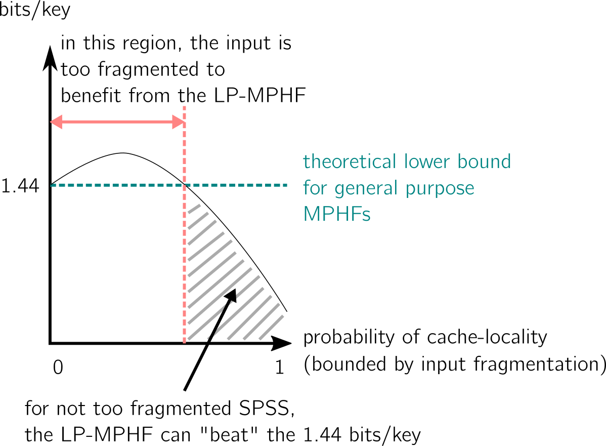

---	
layout: blog
---

# Minimal Perfect Hash Functions in the _k_-mer world

October 28, 2022

Three days ago, a [new hashing technique](https://arxiv.org/pdf/2210.13097.pdf) joined the bioinformatics MPHF family. Since I've participated in some of the projects revolving around these techniques, a blog post was long overdue. This one is proudly powered by the mysterious energy I've been collecting from my maternity leave...

Here's a summary. We'll first quickly review the concept of MPHF and hash tables. Then, there is a bit on the two first MPHFs designed in a bioinformatics context (although they are also meant for more general inputs), which leads to _k_-mer hash tables and _super-k-mers_. Finally, if you're interested in the latest work only, start directly in the last section.

## Minimal perfect hash functions (MPHF) recap

To hash is the simple action to associate an integer (a value) to an object (a key). There are many ways to do this, depending on the expected mapping properties between a set of objects and the chosen integer space. A hash function is a function that maps a set of objects or keys to integers. Hashing is usually defined such that the set of objects is hashed in a (or close to a) uniform, random way to the set of values, which means that hash functions are expected to “shuffle” the entry set.

Associating numbers to objects is an important aspect of indexing, in which a set of keys is associated with a table (usually some space allocated in memory) using the mapping returned by the hash function. General hash functions are designed to work with objects sets of arbitrary length, and do not take into consideration the initial size of the key set. Since these functions remain only pseudo-random in practice, key collisions also occur, which means that two different input keys are hashed to the same integer. Therefore, two sources of time and memory costs arise: there will exist empty slots in the allocated table due to collisions, and collisions must be dealt with, often using extra data-structures.

**Minimal perfect hash functions** are meant to avoid both sources of costs. In short, they are bijective (i.e., surjective = minimal, and injective = perfect): they guarantee that the size of the values set is equal to the size of the keys set. Which means: no collisions, and no extra space needed. In bioinformatics, a typical use case is to have _k_-mer sets as input key sets, with additional information to be looked-up in the table, such as abundances in datasets or positions in genomes. With an axolotl having ten times more k-mers than the human (thus a 30 billion k-mers or so), we do not like extra costs. This is why minimal perfect hash functions (MPHF) come handy.

(*Credits for this Figure showing the MPHF scheme in comparison to others: [Rayan Chikhi](http://rayan.chikhi.name/).*)

One key idea is that the **MPHF is static**, because it is especially carved for the very set of keys it has to hash. It means that it is computed for a given set of _k_-mer, and cannot be used for another set. It also means that if a _k_-mer must be added to the initial set for some reason, the function must be computed again (i.e. it is static, not dynamic).

**A MPHF’s goal is simply to hash, not to provide a way to store information associated with keys, nor to lookup keys (and especially alien keys) in a safe way. In order to handle these operations, a hash table must be constructed using the MPHF**. The hash table will use the MPHF to hash keys, and encompass a way to remember the identity of keys that have been hashed (that we will call key set representation, or in our precise case, _k_-mer set representation).

## MPHFs in bioinformatics

### BBHash (2017)

I'm not a specialist at all in general-purpose MPHFs, and there is an extensive literature dealing with the best ways to build MPHFs. The core message is that mainly, the literature has produced MPHFs chasing the theoretical lower bound of ~1.44 bits/element. [BBHash](https://arxiv.org/abs/1702.03154)’s authors chose another tradeoff, by **paying more bits per element in order to accelerate both the construction time and the query time** of their MPHF. These two aspects were crucial in order to deal with the order of magnitudes met in bioinformatics, where a typical metagenomics experiment with short-reads can yield several billions k-mers per sample.

BBHash at a glance: Take the set of keys, hash it with a function that has nice uniform hashing properties (such as [this one](https://en.wikipedia.org/wiki/Xorshift#xorshift*)). Despite the nice properties, a real uniform distribution is unlikely to be reached, and we'll have some collision. Then collect the keys for which there were collisions. Keep the others as is. Hash a second time the keys that previously collided, with another hash function of the same kind. We expect that some collisions will resolve, since we changed the function. Iterate G times, until there are no collisions anymore (or until a small number of keys with collision remains, which are dealt with in an additional structure).

Imagine a hash table based on that MPHF. When an element (from the initial set) is looked-up, it is hashed using the first hash function, and hopefully an associated integer is found, hence a value is associated at some index in the table. However, if it is not the case, it will produce a cache-miss, which means that a memory access has been made without achieving the final result. The function can lead to at most G cache misses, because the element might need to be hashed G times to be finally found.

The paper shows that the algorithm rapidly converges toward almost each key having a different value (which respects the expected "perfect"), with small G values. G is called the Gamma parameter in BBHash’s paper, the larger it is, the smaller the bit/key and total space of the structure will be; but the smaller it is, the least cache misses will be produced when an element is looked-up.

### PTHash (2021)

[PTHash](https://dl.acm.org/doi/abs/10.1145/3404835.3462849?casa_token=2O7CUKGkaYwAAAAA:7si6HMx2EZMsPy7IRBNf7MRxFLieU-O9eMjPVVlmYWtALaGzuzkG5FbQKO01kF7kUMXPH0TLt4lbTg) remains in the same spirit as BBHash, in the sense that it aims at practical efficiency. In particular, it improved on BBHash’s lookup time ([link to implementation](https://github.com/jermp/pthash)).

The core idea is the following. For a set of keys of size n, associate each element to b<n buckets. Because of the properties we revised earlier, some buckets will contain more than one key, others will be empty, but globally each will be an order of magnitude smaller than the initial set. A final image vector is allocated, which has the same cardinality as the set of keys. Using that divide-and-conquer approach, for each bucket one can try different hash functions until all elements of the bucket are in the vector without collision. The cost of finding a function that fits is crucial and grows exponentially with the size of buckets, hence the need for small buckets.

**A very strong property is that this scheme has a single memory-access per lookup.**

## General purpose k-mer hash tables (BLight (2021), SSHash (2022))

### Main concepts

I will mainly focus on [BLight](https://academic.oup.com/bioinformatics/article/37/18/2858/6209734) and [SSHash](https://www.biorxiv.org/content/10.1101/2022.01.15.476199v2.abstract)([link to implementation](https://github.com/jermp/sshash)) because they rely on previously presented methods, although other structures exist (and are tightly related).

Technically, [Jellyfish](https://academic.oup.com/bioinformatics/article/27/6/764/234905), the k-mer counting tool, could provide a k-mer hash table as well, but it was not designed for efficiency. These tables have been used for various purposes, one of the big highlights I have in mind is [Cortex (2013)](https://academic.oup.com/bioinformatics/article/29/2/275/203471), an early colored de Bruijn graph technique. Today such structures appear in genome indexes (e.g. [Pufferfish](https://academic.oup.com/bioinformatics/article/34/13/i169/5045749)), mappers (e.g. [Puffaligner](https://academic.oup.com/bioinformatics/article/37/22/4048/6297388)), recent types of colored de Bruijn graphs (e.g. [Reindeer](https://academic.oup.com/bioinformatics/article/36/Supplement_1/i177/5870500))...

**A hash table contains two main ingredients: 1-the hashing scheme carried by the hash function ; 2-the table and how keys are stored in it in order to check them at the lookup**. BLight and SSHash carry two main ideas:

-   **use a MPHF** as the underlying function of the hash table (BBHash for BLight that was published in 2021, and the more recent PTHash for SSHash that was published in 2022)
    
-   use a **k-mer set representation** that is more efficient base-wise than representing plain k-mers (i.e. it takes less bits to encode that representation than it would take to encode each k-mer separately), and that provides a partition of the _k_-mers which grants interesting **locality-efficiency** (i.e., consecutive k-mers are likely to be loaded altogether in the cache, leading to faster computation)
    

The second point is particularly interesting query-wise, because queries in bioinformatics may not involve single _k_-mers alone, but may occur from longer sequences being split into consecutive, _k_-1 overlapping _k_-mers that are all looked-up in the table.

### Key set representation: _super-k-mers_

I have said that _k_-mer hash tables use efficient _k_-mer representations as inner components. These representations belong to a family of objects called **spectrum preserving string sets** (first defined in [Rahman and Medvedev 2020](https://www.biorxiv.org/content/10.1101/2020.01.07.896928v2)), or **SPSS** for short. A SPSS is a set of strings longer or equal to k, that can be built over a set of k-mers, sequences or reads. This set 1-preserves all the k-mer sequences, 2-has each k-mer appearing only once. The most trivial SPSS is the _k_-mer set itself. 

**_Super-k-mers_** are a type of SPSS. They are used in both BLight and SSHash. They are built by compacting all consecutive k-mers of a an input sequence (read, contig, …) that contain the same **minimizer**. See for instance, using lexicographic order:

Being small enough, _super-k-mers_ extract “chunks” from sequences that are likely to be handled altogether by the computer.

_Super-k-mer_ partitioning is used in BLight, and SSHash goes further by analyzing more in depth the properties of minimizers. The paper shows that on many genomes, from a size c (typically around 20 nucleotides for large eukaryote genomes), most _super-k-mers_ are unique (i.e. the _super-k-mer_ distribution is highly skewed). In other words, **_super-k-mers_ can offer a deterministic partitioning of the k-mers under certain conditions**. It leads to optimizations by considering unique _super-k-mers_ as the general case and treating a few exceptions in an additional data-structure.

Using _super-k-mers_, both methods propose a way to quickly verify if a looked-up key was present in the initial set hashed by the MPHF. Coupled with the MPHF, they yield a hash table for _k_-mers following this idea:

The MPHF id given by the minimizer coupled with the position in the bucket of _super-k-mers_ is sufficient to provide a unique identifier for _k_-mers and to look them up. An alien _k_-mer could still share an existing minimizer, obtain a value by the MPHF, but would not correspond to the _k_-mer stored at the given position. It would be detected as an alien key.

## What about k-mer hash… functions? LP-MPHF (2022)

To date, we used general purpose MPHFs in _k_-mer hash functions, as presented in the previous section. In October 2022, the joint work of authors from BBHash, BLight, PTHash and SSHash led to the design of a **MPHF specialized for _k_-mer sets**, called [LP-MPHF](https://arxiv.org/pdf/2210.13097.pdf) ([link to implementation](https://github.com/jermp/lphash)).

"LP" stands for "locality-preserving", a property we've discussed with _super-k-mers_. As we’ve seen, _k_-mer sets from biological sequences have special properties, namely carrying a lot of redundancy through overlapping _k_-mers. The method draws from this fact to propose a function whose bit/key requirements can be smaller than the lower bound of general MPHFs which work on any entry type. But it goes further, if we consider the information we'd like to associate to _k_-mers with such a MPHF. **Consecutive _k_-mers are likely to share same features** (e.g., same abundance value in a dataset, same presence/absence patterns in a collection of genomes). By preserving the locality of these _k-mers_, **the LP-MPHF also prepares the ground for efficient compression** of associated information.

Mainly, it relies on concepts and methods we’ve reviewed: PTHash, _super-k-mers_ and their skewed distribution, partitioning. There are two more points to be discussed: dataset fragmentation and properties of _k_-mers within a _super-k-mer_.

### General idea of the LP-MPHF

The input of the LP-MPHF is a SPSS. However, the LP-MPHF would not achieve its best performances on a plain _k_-mer set, because of its fragmentation (we will come back to this). Therefore, it would rather start from SPSS made of longer strings (a list of examples appears in another blog post [here](https://kamimrcht.github.io/webpage/tigs.html) and with more details in this [preprint](https://arxiv.org/abs/2209.06318).

Here we must note that the LP-MPHF works on a formatted input: in order to build a non-trivial SPSS, _k_-mers must be counted and some operations are necessary to build the strings. In the case of general purpose MPHFs used for k-mer sets, the user also had to make sure that every _k_-mer in the input appeared only once.

The LP-MPHF uses _super-k-mers_ as an inner component, for their properties mentioned in the hash tables section. At a glance, they work this way:

In short, in the scenario where a minimizer exists in a single _super-k-mer_, there is a 1:1 relationship between the two that is easy to compute. Then, using a MPHF scheme (such as PTHash) super-k-mers can be associated to their statuses (we detail one status afterwards), and these statuses determine (with some extra information) a unique identifier for the _k_-mer using the minimizer.

In the following, we come back to the data fragmentation which has an impact on performances, and on some properties of _super-k-mers_ used for LP-MPHF.

### How to get a unique _k_-mer id from its _super-k-mer_

Here we will show a single scenario out of the four described in the paper. The authors show that under reasonable conditions, this scenario occurs half of the time, and is the best case scenario for the LP-MPHF. Let’s consider this sequence and its _super-k-mers_:

The first _super-k-mer_ is called “maximal”: the minimizer is exactly in the middle, leading to _k-m+1_ _k_-mers covering it. In that case, recording the position of the minimizer in each _k_-mer of the _super-k-mer_ is sufficient, since we know that the first _k_-mer will have the minimizer at position _k-m_, the second at position _k-m-1_, and so on to the last at position 0.

In the case the _super-k-mers_ are unique and maximal in the input, it is enough to compute a _k_-mer’s minimizer to uniquely identify its _super-k-mer_, and it is enough to retain the minimizer’s position in the _k_-mer to uniquely identify the _k_-mer. This property is used by LP-MPHF to cover a lot of cases, by recording a very small amount of information.

There are other cases, where the _super-k-mer_ is not said “maximal” (the minimizer occurs at other positions than in the middle). The paper gives details on how to transpose the above strategy, which requires a bit more information to be recorded in order to uniquely identify the _k_-mers. There are also cases where the _super-k-mer_ is repeated in the input SPSS, which are dealt in a non-optimal way at the moment. The authors highlight it as a future work.

### Dataset fragmentation

We said the LP-MPHF tries to work on the _k_-mer redundancy of a given sequence set. However, if the function’s input is a _k_-mer set itself, it will not be able to build _super-k-mers_ longer than _k_-mers, hence losing the possible _k_-1 overlaps. Using SPSS with longer strings, such as unitigs or simplitigs, one allows _super-k-mers_ to be more likely optimal for the LP-MPHF.

Here is my interpretation of one of the figures from the paper, where the number of bits/key of LP-Hash is plotted as a function:

### Open questions

- Is there a better SPSS than _super-k-mers_ to represent the set of keys in this application case? Possibly, one of the figure in the paper shows that LP-MPHF do not reach yet the new theoretical lower bound. A related question is how to deal efficiently with non-unique _super-k-mers_.
- Can we think of solutions for fragmented input sets? The fragmentation is tightly linked to the representation of a _k_-mer set using a de Bruijn graphs, with _k_-1 overlaps between _k_-mers. Current SPSS focus on _k_-1 overlaps to link k-mers, but there must be possible generalizations.
- Currently, PTHash is an inner component of LP-Hash. I wonder if there could be some kind of recursive use of LP-Hash.

## Acknowledgments
My [partner in crime](https://twitter.com/BQPMalfoy) reviewed this post with an expert's eye, as well as a second member of the LP-MPHF crew, [Giulio](https://jermp.github.io/). Thanks guys!
