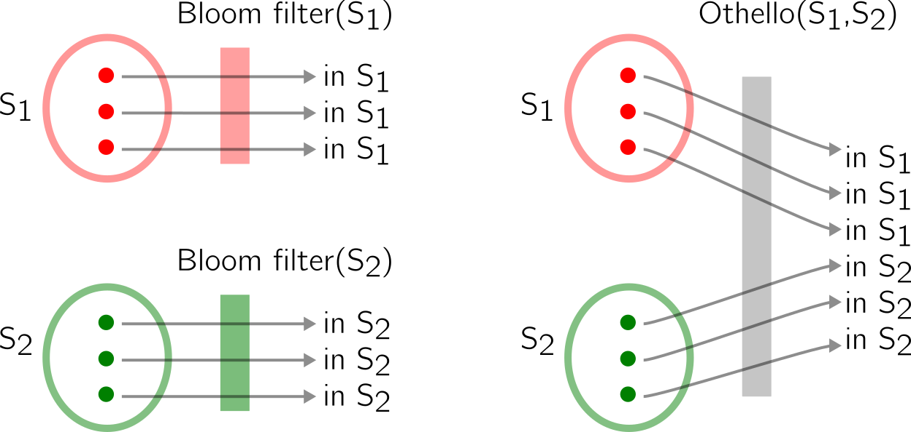
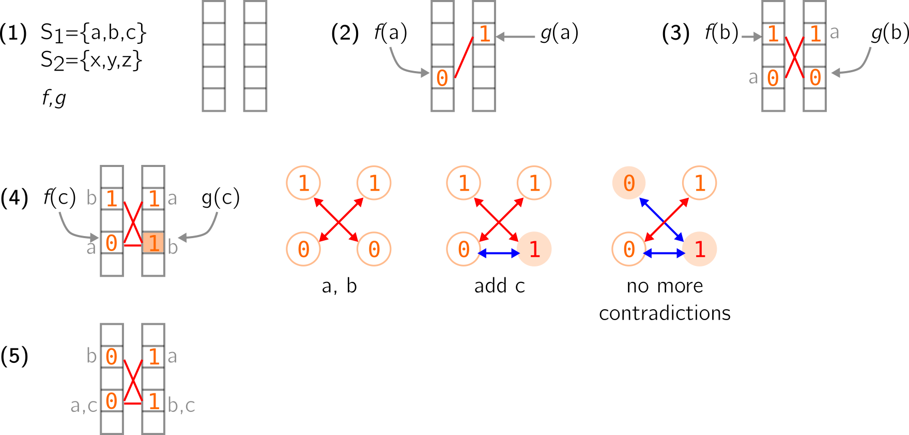
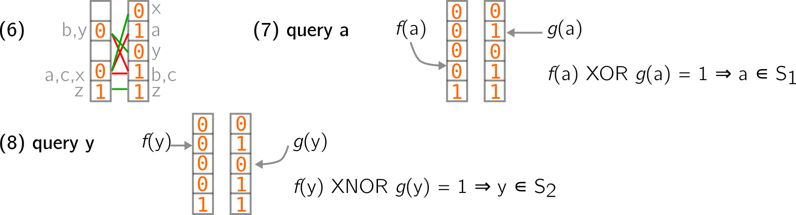

---	
layout: blog
---

# Additional content for _Data structures based on k-mers for querying large collections of sequencing datasets_

July, 23th 2020.

Hi all, 

**In a summer series of blog posts, I will follow up on some data-structures that have been mentionned in our manuscript _Data structures based on k-mers for querying large collections of sequencing datasets_[[1]](https://www.biorxiv.org/content/10.1101/866756v2.full), but that would benefit from more insight. Today I focus on Othello hashing and its application to bioinformatics.**

As a short reminder, the manuscript deals with structure indexing sets of read sets for querying sequence presence/absence.
Let's assume you have the genomic signature of a mutation, that you'd like to look for in a collection of samples (read datasets). These data-structures allow you to 

* 1-index the whole collection of datasets (up to a few thousands for eukaryotes), 
* 2-query your sequence and know whether it is present/absence in each dataset.

The data volume to handle is tremendous. One of the main tricks used by the surveyed methods is to represent the samples as sets of k-mers (i.e., fixed-length words extracted from the reads, typically 21-31 bases-sized) instead of multi sets of reads (queries are also performed using the k-mers of the sequence).
So a compulsory stage is to index all these k-mers. 

Today I'll focus on the data-structures used to index k-mer sets (and I'll restrain to those that are indeed used in the surveyed methods).
Some of them are very atomic, what I mean is that they can be used as is to index k-mers; others are like Russian dolls, these data-structure integrate other, often more low-level data-structures. 
For people who are already familiar with Bloom filters, the interesting part starts at the [Othello](#othello-hashing-in-bioinformatics) section.

## Index sets of k-mers

One of the simplest, most famous one is the **Bloom filter**. It has been so helpful and well-described in bioinformatics that I don't feel the need to introduce it again. You can find plenty of good descriptions of the Bloom filter online, here is just an example: [llimllib.github.io/bloomfilter-tutorial/](https://llimllib.github.io/bloomfilter-tutorial/).
They basically tell you if an element is present or not in a set, with false positives (no false negatives).

In methods such as the different Sequence Bloom Trees [[2]](nature.com/articles/nbt.3442), [[3]](https://www.liebertpub.com/doi/full/10.1089/cmb.2017.0258?casa_token=aJfQ9NULKVYAAAAA%3AwlbfsCl9XVFiVjpkimFC0gkKDDpiktZGOSk0UTN8ofy86XW6pnrhYHXRXJAKvOcmu4xgkzaFXnAy), [[4]](https://link.springer.com/chapter/10.1007/978-3-319-56970-3_16), [[5]](https://academic.oup.com/bioinformatics/article-abstract/36/3/721/5553093) and BIGSI and its refinement [[6]](https://www.nature.com/articles/s41587-018-0010-1), [[7]](https://link.springer.com/chapter/10.1007/978-3-030-32686-9_21), there is a one-to-one correspondance between Bloom filters and datasets. Each dataset is represented by a single Bloom filter, even if it means that k-mers can be redundant across datasets. 

Bloom filters pertain to the large family of hash-based techniques, that rely on **hash functions**. 
Hash functions are functions used to map elements (of arbitrary length, such as a sequence) to fixed-sized numeric values.
For instance, for the sequence "BIOINFO", a (bad) hash function gets the ascii representation of the last character and applies a modulo (10). Working with the [decimal values](http://www.asciitable.com/), we obtain 79 for O, and 79%10=9 as a final value.
Remarks:
* The function ensures that we will have values from 0 to 9 for any input element. Very useful in order to put these elements in a fixed-size table for instance.
* The function will return different values for different elements, and is deterministic. "BIOINFO" will always be hashed to 9 with this function. "BIATA" for instance will end up mapped to 5.
* Why bad? Because, in the general case, a "good" hash function is supposed (among other characteristics) to map similar strings to very different values. Here, any word finishing with "O" will be hashed to the same value than "BIOINFO", which is not a nice property. Why ? Let's switch to the RNA world. Many different k-mers end with a poly-A tail. If a hash function works only with the last characters, the data-structure that relies on this function will accumulate these k-mers in a similar place in the memory, which can be harmul to the method's performances.

Another data-structure based on hash functions is the **quotient filter** (and the counting quotient filter). Again for these methods, there already exist online documentation such as: [gakhov.com/articles/quotient-filters.html](https://www.gakhov.com/articles/quotient-filters.html) , [blog.acolyer.org/2017/08/08/a-general-purpose-counting-filter-making-every-bit-count/](https://blog.acolyer.org/2017/08/08/a-general-purpose-counting-filter-making-every-bit-count/).

They are somehow related to the Bloom filter, but can in certain cases guarantee no false positives.
Counting quotient filters are used in Mantis [[8]](https://www.sciencedirect.com/science/article/pii/S2405471218302394).

## Othello hashing in bioinformatics

### Intuition of Othello hashing

A third method that I believe is less popularized is Othello hashing. 
Introduced by Yu et al.[[9]](https://arxiv.org/pdf/1608.05699.pdf), it realizes a slightly different goal than Bloom filters and quotient filters.
The original article is motivated by network algorithms and quite far from bioinformatics.
Here I'll give you an intuition of how it works.

As I've said earlier, one Bloom filters informs you on the presence of an element in a set. 
A Othello tells you if an element is present in a set of disjoint sets.
Let's have a look at an example:

How does it work? 

* Let's start with two vectors, a pair of (wisely chosen) hash functions and two disjoint sets S1 and S2 (see **(1)** below). We will store elements of S1 and S2 in the vectors using the hash functions.
A rule is that an element from S1 must correspond to two different values in the two vectors, while an element from S2 must correspond to two similar values.
So, elements from S1 must be associated with (0,1) or (1,0) pairs, and elements from S2 must be associated with (0,0) or (1,1) pairs.
I choose to simplify the original article in which integers (not booleans) are used.

* In **(2)** below, the first element a of S1 is added using the two hash functions f and g. It is associated to (0,1) using the two vectors.
I use a red stroke to show that these two positions are linked.
I'll also write in grey, next to the vectors, the elements (though this is not an information that is effectively retained).

* In **(3)** same occurs for the second element b of S1. 

* In **(4)** above, the third element c of S1 is added too. However, it is hashed to two places that are already occupied. It leads to a contradiction because if values associated to c are (0,1), then the value in the right vector must be changed to 1 (colored position), which is problematic because b has now a (1,1) pair.
To solve this issue, we can represent the occupied positions as a graph, with edges being the red links I draw before.
The leftmost graph shows what happens when a and b are added. Two nodes that share an edge must have different values in this graph.
When adding c, the blue edge is created and leads to change 0 to 1 (red node). But there is now a (1,1) edge. 
So the change can be propagated along this edge, i.e., the other node's value is switched as well (from 1 to 0).
This leads us again to a graph that respects the given property, and to proper vectors in **(5)**.

* Fast forward in **(6)** below, we continued filling the structure with elements from S2. You can notice that any element from S2 is associated to a pair of similar values (I put green strokes to draw the links between values of a pair).
For the query, we know that if a queried element is associated to a pair of different values in the structure, it comes from S1. If it is associated to a pair of similar values, it comes from S2. This can be converted to logical operations, XOR and XNOR. Elements are hashed and these operations are performed on the result to check the membership (**7 and 8** below).
In practice, the structure can yield false positives (i.e., it tells you an element is in one of the indexed set, while in reality it is not).

This concept can be further extended to more than two sets.

### Othello in SeqOthello
Othello appears in bioinformatics in the method SeqOthello [[10]](https://link.springer.com/article/10.1186/s13059-018-1535-9).

Next up : **minimal perfect hashing** and in particular the paper by Limasset et al. in 2017.

# References

* [[1]](https://www.biorxiv.org/content/10.1101/866756v2.full) Survey _Data structures based on k-mers for querying large collections of sequencing datasets_

* Tools working with Bloom filters

[[2]](nature.com/articles/nbt.3442) SBT

[[3]](https://www.liebertpub.com/doi/full/10.1089/cmb.2017.0258?casa_token=aJfQ9NULKVYAAAAA%3AwlbfsCl9XVFiVjpkimFC0gkKDDpiktZGOSk0UTN8ofy86XW6pnrhYHXRXJAKvOcmu4xgkzaFXnAy) AllSome SBT

[[4]](https://link.springer.com/chapter/10.1007/978-3-319-56970-3_16) SSBT

[[5]](https://academic.oup.com/bioinformatics/article-abstract/36/3/721/5553093) HowDeSBT

[[6]](https://www.nature.com/articles/s41587-018-0010-1) BIGSI

[[7]](https://link.springer.com/chapter/10.1007/978-3-030-32686-9_21) COBS

* Tools working with counting quotient filters

[[8]](https://www.sciencedirect.com/science/article/pii/S2405471218302394) Mantis

* Othello hashing

[[9]](https://arxiv.org/pdf/1608.05699.pdf) Original paper

[[10]](https://link.springer.com/article/10.1186/s13059-018-1535-9) SeqOthello

