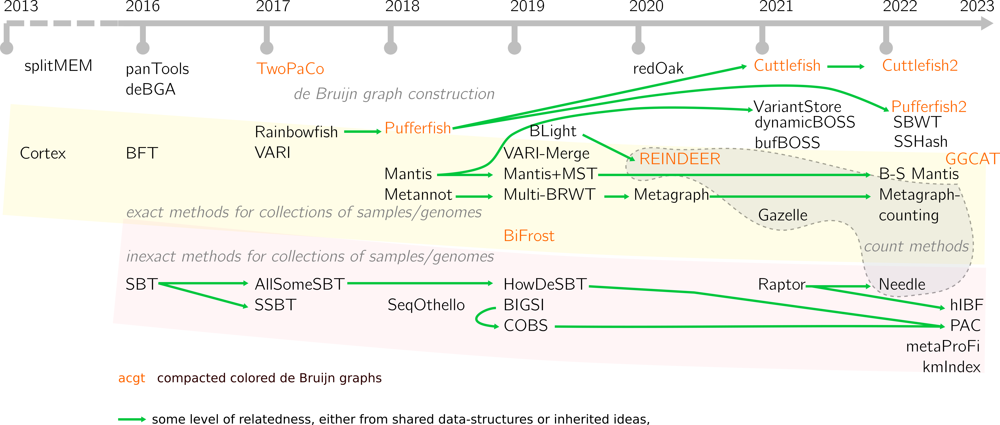

---	
layout: blog
---

November 2, 2022

# Data-structures for sets of _k_-mer sets: what's new since 2020

Our paper [Data structures based on k-mers for querying large collections of sequencing data sets](https://genome.cshlp.org/content/31/1/1.short) is two years old, and although the core concepts we described are still relevant, new ideas and methods have emerged or strengthened since. Thus I wanted to keep you up with the literature in a short post.

These structures store collections of datasets (often samples, can also be sets of contigs or genomes) using their _k_-mers. They are used to perform _k_-mer queries in all samples at once, thus provide an interesting pre-filter for large collections before more costly methods such as mapping are applied. 
The presented methods are designed for short read samples or relatively small/medium _k_-mer sizes.

## The landscape of sets of _k_-mer sets
In the first figure of the survey, we had chosen to present the different implemented methods in a timeline. I've been trying to keep it updated. At the time, we narrowed the paper to a defined set of tools, although it is clear that frontiers are blurred between some data-structures. Here I try to present a larger view. Despite trying my best, these things are never exhaustive, it is possible that I've forgot to mention tools. 

Please note that tools for pangenomics graphs such as VG, minigraph and others do not appear here. They differ mainly because here the expected input can be unordered, while pangenomic representations include coordinates.

The paper was also organized around a dichotomy between two types of structures. First, color-aggregative methods, that index the union set of all distinct _k_-mers of the collection, before associating colors with these _k_-mers (colored de Bruijn graphs usually fall in this category). Second,  _k_-mer aggregative methods index each data-set separately, then build another data-structure on top to distribute queries. 

Today, I would rather present the methods in a 2 dimensional fashion:

There are more exact methods than inexact ones. SeqOthello remains an alien (the single red point in its category).

## Main novelties

**Beyond presence/absence**

- Following Reindeer, other structures started to allow the recording of _k_-mer features that are different from presence/absence of a dataset, e.g., abundance, contig id... [Needle](https://academic.oup.com/bioinformatics/article/38/17/4100/6633930) is the first inexact data-structure with this goal, and was released in 2022.
- [Metagraph](https://www.biorxiv.org/content/10.1101/2020.10.01.322164v2.abstract) appeared shortly after the survey, followed by an [additional paper](https://link.springer.com/chapter/10.1007/978-3-031-04749-7_34) for recording other _k_-mer features in the data-structure. It was a breakthrough because of the amount of data that they could index. I would say the approach is a bit different from e.g. BiFrost or Reindeer: Metagraph's team have computed numerous indexes that are available for the public on their website, while other tools are maybe more meant to be installed and run locally.

**More to the inexact structures landscape**

- We've briefly mentioned Dream-Yara's interleaved Bloom filter (IBF) technique back in 2020. To me, they are very close to what COBS proposed with the inverted matrix of Bloom filters, the difference being the organization of bit vectors and some optimization choices. The team has developped this technique and several papers came out: [Raptor](https://www.sciencedirect.com/science/article/pii/S2589004221007501), [Needle](https://academic.oup.com/bioinformatics/article/38/17/4100/6633930) and a [preprint](https://www.biorxiv.org/content/10.1101/2022.08.01.502266v1.abstract) this year.
- With [PAC](https://www.biorxiv.org/content/10.1101/2022.02.11.480089v2.abstract), we proposed an attempt to conciliate the interesting query complexity properties of the SBTs and the efficient inverted index inspired by document retrieval, that COBS introduced.
- The inverted index has started to hybridize with other techniques, such as sketching [in this work](https://www.biorxiv.org/content/10.1101/2022.03.07.482835v2.abstract).
- Satellite algorithms and data-structures for inexact structures emerged, such as [quick Bloom filter construction and filtering](https://tlemane.github.io/pdf/Lemane2022.pdf) or [false positive reductions in Bloom filters](https://www.biorxiv.org/content/10.1101/2022.06.27.497694v2.abstract).

**Improvements in inner components**

- We could say that the [spectrum preserving string set](https://pubmed.ncbi.nlm.nih.gov/33290137/) (SPSS) concept matured, with many [novel contributions](https://arxiv.org/pdf/2209.06318.pdf), some of which help with storing efficiently the _k_-mer sets in our data-structures.
- SPSS also inspire new developments, such as reference sequence representation in [Pufferfish2](https://www.biorxiv.org/content/10.1101/2022.10.27.513881v1)
- Some of the exact methods/colored de Bruijn graphs relied on efficient hashing and notably minimal perfect hashing, which has seen [many improvements in two years](mphf.md) (see [here](https://arxiv.org/abs/2210.13097) for the latest). Along with these work, the question of a better compression of the features that are associated with _k_-mers starts to emerge (see [here](https://www.biorxiv.org/content/10.1101/2022.05.23.493024v1.abstract)). Compression is certainly one of the next big challenge for these structures.
- BiFrost has been one of the most successful datastructures for buildling compressed colored de Bruijn graphs in the last years, with notably an innovative unitig construction step. [GGCAT](file:///home/cmarchet/Downloads/2022.10.24.513174.full.pdf) appears a nice improvement.

