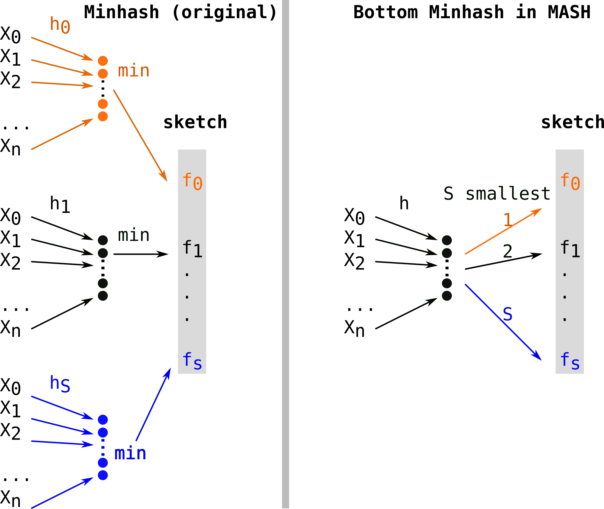

---	
layout: blog
---

# Sketching for set comparison in bioinformatics
January 21, 2022

Following the release of several recent preprints, I decided to write a post to group a few concepts about sketching. It is meant to serve as a reminder of the main approaches, for myself as well, as I easily get lost about who's who between bindash/dashing/mash and so on. If you're already familiar with MinHash, skip directly to the [next section](#reduce-the-memory-footprint-of-hashes).

## MinHash principle

MinHash is a type of local sensitive hashing technique: it means that similar input sets will be hashed similarly with high probability. Thus, similar sets of hashes can be used to retrieve similar sets with some confidence.

Let’s assume we have a set of size n E={x1,x2...xn} (see figure below) and a set of hash functions H={h1,h2,… hs}. 
For each function of H we compute:
fi = min(hy(x1), hy(x2), ...hy(xn))
for a given order relation O.
We obtain a set F(H,E)={f0 .. fi ..fn} of size S=|H| containing minimal elements  for O of hashes of elements from E (that we will call **fingerprints**).

When this procedure is used on two sets E and G, a **Jaccard index J(E,G)** can be approximated on the elements of F(H,E) and F(H,G). Work on MinHash[[1]](https://ieeexplore.ieee.org/abstract/document/666900) has shown that computing J(F(H,E), F(H,G)) gives a **good proxy on average of J(E,G)**.
. In the figure below, minimal hashes over E and G are represented using small red crosses:

When E and G are similar enough, the approximation can be satisfying. 
However, there are scenarios in which this approximation is not good, and in particular **when E and G are dissimilar, or have very different sizes**.
The intuition is that, because of the random nature of H, the estimated intersection of E and G is populated with too many, or too few hashed minimums. 
Intuitively, more fingerprints (increasing S) reduce the variance of the mesure, but it comes with more computation. 

In a [review on sketching methods in bioinformatics](https://genomebiology.biomedcentral.com/articles/10.1186/s13059-019-1809-x), Will Rowe defines sketching as follows:

> Put simply, sketching is the process of generating an approximate, compact summary of data. A sketch supports a set of predetermined query and update operations, which are used to approximate the original data. Compared with non-probabilistic algorithms, sketching requires less memory and has constant query time.

Here I rely on a (maybe controversial) difference between two procedures, sketching and subsampling. **Sketching** is the operation that produces a **vector of fingerprints fi (a sketch)** from E. For instance, E may be a set of k-mers from a genome or a sample. Comparing sketches is adapted for sets of sizes of the same order of magnitude. Tools such as MASH[[2]](https://genomebiology.biomedcentral.com/articles/10.1186/s13059-016-0997-x) use this principle to compare collections of large, high throughput read sets extremely efficiently.
**Subsampling** adapts to the input size with procedures that aim at computing fingerprints all over the input length, for instance by computing sketches in (relatively) evenly spaced positions over the elements of the input. For instance, this can be useful to compare two long reads with different sizes. Minimap[[3]](https://academic.oup.com/bioinformatics/article/34/18/3094/4994778?login=true) is a good example of subsampling (but falls in Will's definition of sketching).

In the following, we will see on which aspects works focused to improve the performances of the original MinHash procedure. We will review 3 aspects: the memory footprint needed to store the sketches, the complexity of the sketch construction and the complexity of the sketch comparison.

# Several MinHash flavors
Let's first recall the construction procedure and its complexity in the case of the**original MinHash** approach.
Constructing a sketch means computing S hash functions (h0, ...hS) on n elements, thus will leads to a O(Sn) complexity. Several hash functions are shown in different colors (orange, black, blue). For each hash function, the minimal element is kept as a fingerprint (fi, same color as the hash function) for the final sketch (in grey).

First alignment free comparison tools used k-mer sets without subsampling (such as COMMET or Simka for instance).  **Mash**[[2]](https://genomebiology.biomedcentral.com/articles/10.1186/s13059-016-0997-x) overtook the field when it was published, because of its uncomparable performances. MASH used a variant of Minhash sometimes called **Bottom Minhash**[[8]](https://link.springer.com/chapter/10.1007/3-540-45726-7_1). This second approach uses a single hash function (h) and keeps the S minimal values (in color) as fingerprints among hashes of elements of E. This leads to computing only n hashes which be sorted in order to keep the S (with S<n) smallest, thus a O(n log(S)) construction complexity.

**Sourmash**[4](https://f1000research.com/articles/8-1006/v1) proposed Scaled Minhash as a simple and effective way to adapt the sketch size to the sets. They propose to keep any fingerprints values in the sketch when they are lower than a fixed threshold. Scaled Minhash is recently described in two preprints[here](https://www.biorxiv.org/content/10.1101/2022.01.11.475838v2.full) and [here](https://www.biorxiv.org/content/10.1101/2022.01.11.475870v2) and switched names for **FracMinHash**. Quoting [the first preprint](https://www.biorxiv.org/content/10.1101/2022.01.11.475838v2.full) illustrates brilliant sides of Twitter's scientific discussions:

> We note that the FracMinHash technique has been used under a number of different names, including Scaled MinHash, [universe minimizers](https://www.sciencedirect.com/science/article/pii/S240547122100332X), [Shasta markers](https://www.nature.com/articles/s41587-020-0503-6), and [mincode syncmers](https://peerj.com/articles/10805/). The name FracMinHash was coined by Kristoffer Sahlin in an online discussion on Twitter and chosen by discussants as the least ambiguous option. We use it here accordingly.

Another approach, **S partition MinHash**[[9]](http://proceedings.mlr.press/v70/shrivastava17a.html), still works with a single hash function (h), partitions the hashes in S buckets (each represented by a color: orange, black, blue in the figure below) and keeps the minimum element of each partition (also colored in the figure). As the partitioning can be done in constant time, the construction is in O(n). Due to non optimal randow allocation of hashes to buckets, this type of approach requires additional procedures of densification, which deterministically complete empty buckets to reduce collisions. This procedure was implemented in **Bindash**[[10]](https://academic.oup.com/bioinformatics/article/35/4/671/5058094?login=true). Bindash also implemented compression of the fingerprints, which is covered in the next paragraph.

# Reduce the memory footprint of hashes
MinHash and related techniques use large integers to store fingerprints, in order to reduce collisions. However, by construction, MinHash keeps small values. 
This frequently leads to many inoccupied bits in the integer representation, while lowest bits contain almost all the information.
Thus, noticing that MinHash could be using too many bytes per fingerprint, **b-bits MinHash**[[5]](https://dl.acm.org/doi/abs/10.1145/1772690.1772759) proposed to store the b lowest (most informative) bits of MinHash fingerprints. 

In parallel, **Hyperloglog (HLL)**[[6]](https://hal.archives-ouvertes.fr/hal-00406166/) allows to efficiently record the log of a MinHash fingerprints by storing the length of the first run of 0's (the number of 0's before the first 1).

**Hyperminhash**[[7]](https://arxiv.org/abs/1710.08436) (in the figure below) proposed to combine the two approaches.
In our example, we store a fingerprint in a 64 bits integer, thus the number of 0's can be stored using only 6 bits (as 2^6=64).  Separately, Hyperminhash stores the 10 lowest bits so that the whole Hyperminhash fingerprints is coded with a 16 bits integer. This can be thought as a **lossy compression** (a few bits are lost after the 10th, but not all thanks to the 0 run HLL encoding).

The lossy aspect leads to more fingerprint collision, however, it can be mitigated by computing larger sketches since the global footprint has been reduced.

Bindash and then **Dashing**[[11]](https://link.springer.com/article/10.1186/s13059-019-1875-0) implemented these compressions. Bindash integrated b-bits compressed sketches while Dashing opted for hyperloglog-inspired fingerprints (i.e they store logs of the value). These methods mitigate the error due to the loss in compression by storing more fingerprints.

# Improve the efficiency of the comparison
First, we can notice that in Minhash-like approaches, the comparison between two sketches is linear in the size of the sketches, as elements of each sketch can be compared two by two.

Now, let's place ourselves in a practical case where one wants to find genomes similar to a query genomes using their sketches.
Again, we will examine what happens in the original case. Let's assume we want to compare the sketch computed from a genome to a collection of genomes represented by their sketches. In the figure below, each the queried sketch in green is going to be compared to all sketches of the indexed genomes in grey. Methods such as Dashing will compare these objects in O(SN) with S the sketch size and N the number of genomes in the collection.

Finally, **Niqki**[[12]](https://www.biorxiv.org/content/10.1101/2021.11.04.467355v1) proposes to build an inverted index relying on partitioning for a faster access to genomes that share fingerprints with the queries sketch. 
Let's see the example in the figure below. As presented in the right, genome 1 (red) has fingerprints f0 and f1.
f0 falls in partition 1 and f1 falls in partition p (yellow blocks). So in partition 1, f0 will have an entry where genome 1's index (and other genomes containing f0) is stored. Same for f1 and genome 1 in partition p.

There are possibly 2^w raws with w the size of the fingerprint. In reality, contrary to the simplified figure below, the implementation uses dense partitions that record only genome indices of the fingerprints they represent. The complexity is then in O(#hits) where #hits is the number of shared fingerprints. 

This procedure also allows Niqki to do S random accesses per query, one per fingerprint. On the contrary in Dashing's case, every fingerprint of the index is visited.

**Many thanks** to [Kris](https://sahlingroup.github.io/), [Yoann](https://twitter.com/yoann_dufresne) and [Antoine](https://twitter.com/BQPMalfoy) who helped me improve the original post.

## References

Two surveys: [here](https://genomebiology.biomedcentral.com/articles/10.1186/s13059-019-1809-x) and [here](https://www.annualreviews.org/doi/abs/10.1146/annurev-biodatasci-072018-021156?casa_token=-hMZRgldWfgAAAAA:tL15hgM9RR2rRciVqqMJyTnLeWupJPtcjYPmq1CtclMj8hFv1LanReJlDDUpnxG4qsUP7qS824hw7Q)

Hashing/set theory:
- [[1] **MinHash**](https://ieeexplore.ieee.org/abstract/document/666900)
- [[5] **B-bits MinHash**](https://dl.acm.org/doi/abs/10.1145/1772690.1772759)
- [[6] **Hyperloglog**](https://hal.archives-ouvertes.fr/hal-00406166/)
- [[7] **Hyperminhash**](https://arxiv.org/abs/1710.08436)
- [[8] **S-minimal values MinHash**](https://link.springer.com/chapter/10.1007/3-540-45726-7_1)
- [[9] **S-partition MinHash + densification**](http://proceedings.mlr.press/v70/shrivastava17a.html)

Bioinformatics:
- [[2] **Mash**](https://genomebiology.biomedcentral.com/articles/10.1186/s13059-016-0997-x)
- [[3] **Minimap**](https://academic.oup.com/bioinformatics/article/34/18/3094/4994778?login=true)
- [[4] **Sourmash**](https://f1000research.com/articles/8-1006/v1)
- [[10] **Bindash**](https://academic.oup.com/bioinformatics/article/35/4/671/5058094?login=true)
- [[11] **Dashing**](https://link.springer.com/article/10.1186/s13059-019-1875-0)
- [[12] **Niqki**](https://www.biorxiv.org/content/10.1101/2021.11.04.467355v1)

