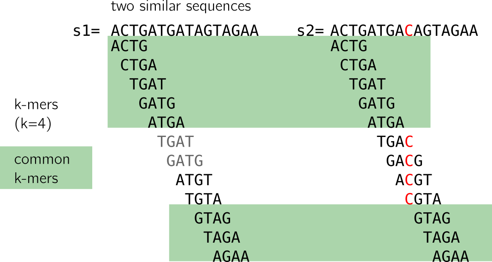
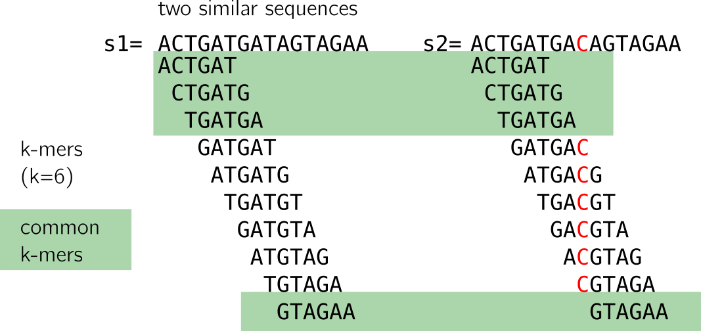
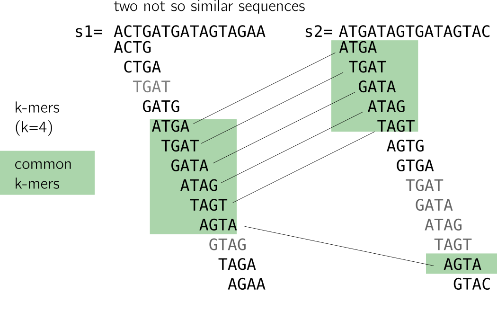
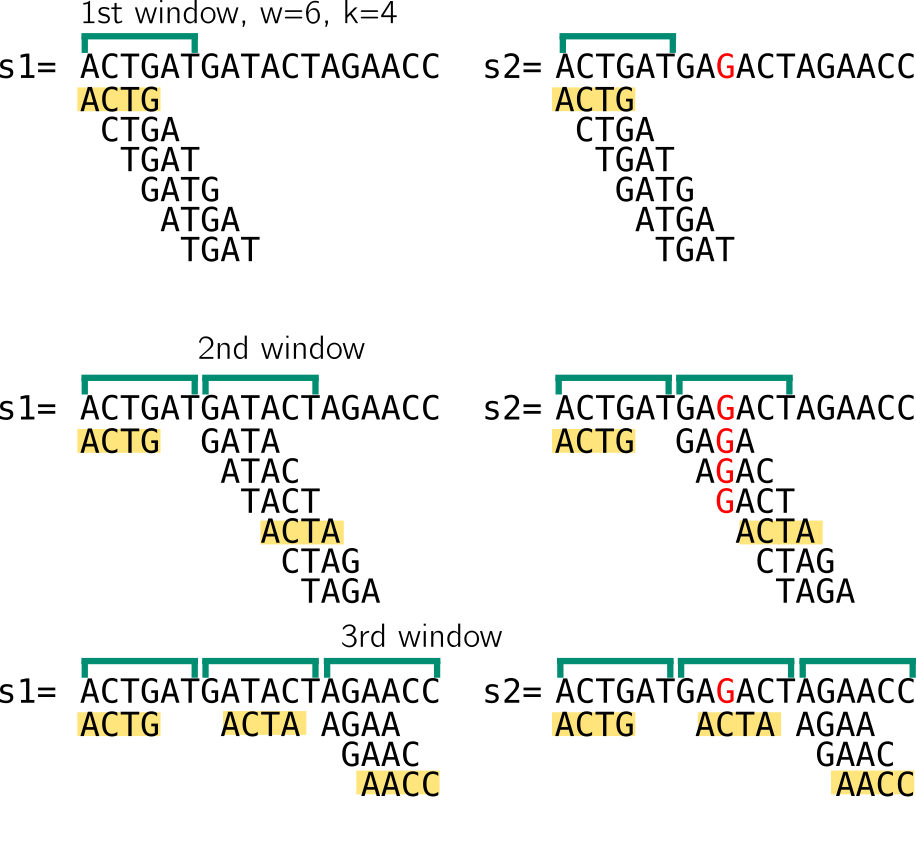
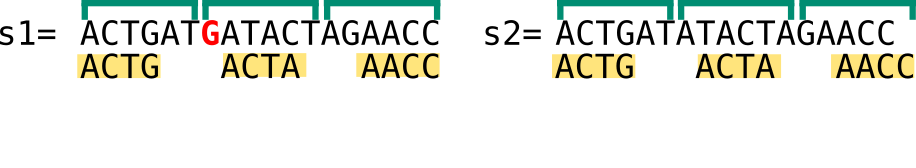
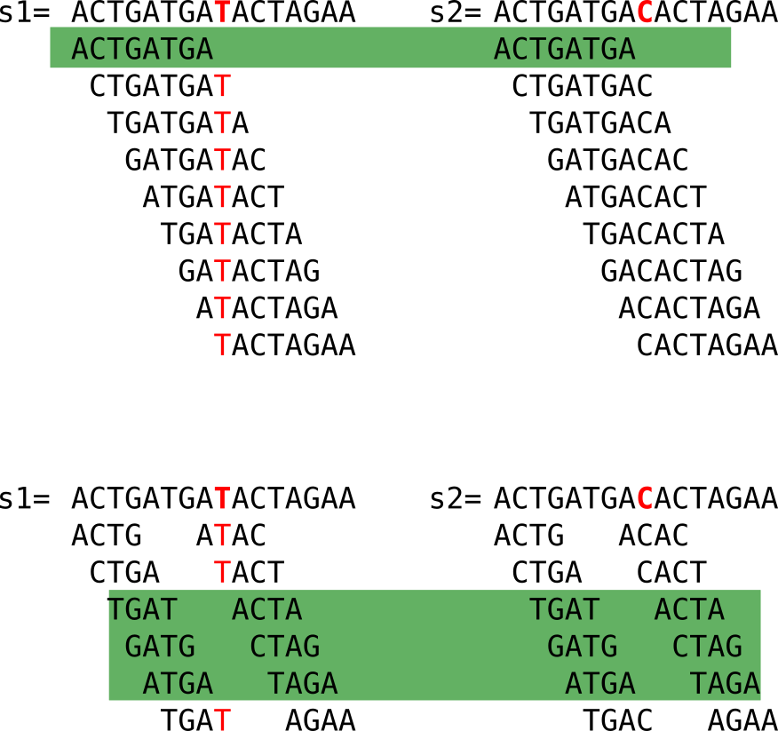
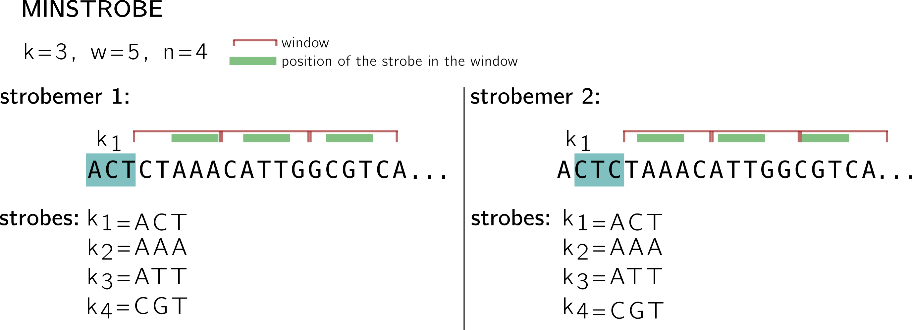
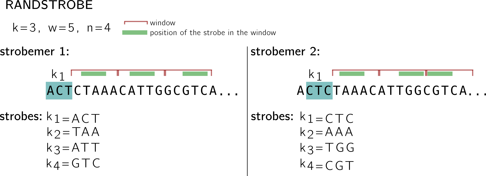

---	
layout: blog
---

# Sequence similarity search with strobemers

February, 4th 2021.

In a recent preprint [Kristoffer Sahlin](https://sahlingroup.github.io/) ([@krsahlin](https://twitter.com/krsahlin)) introduces [_strobemers_](https://www.biorxiv.org/content/10.1101/2021.01.28.428549v1.full.pdf), a new technique derived from k-mers and minimizers to sample and match sequences.
For an introduction to related techniques, i.e. sequence comparison using k-mer sets, minimizers, pairs of k-mers or of minimizers, I'll let the reader refer to the preprint's introduction.

The main motivation of the preprint is **sequence similarity search**, and in particular, finding similar but not identical pairs of sequences. The differences might come from **mutations or errors such as in TGS** reads. 
I'll just come back to two simple notions:  that a distance can be computed between two sequences by comparing their k-mer sets, and that minimizers do that job too, before we get to strobemers.
**Please skip these paragraphs if you want to [go directly to the strobemers](#5--the-strobemers).**

# 1-Similar sequences will lead to similar k-mer sets

Here I show to sequences that differ only by one nucleotide, marked in red in the second sequence. Let's have a look at the following figure:

When we compute the k-mers (k=4), we notice that:
- some k-mers (in grey) are redundant, here we focus on the set (thus forget the k-mers in grey)
- many k-mers are shared between the two sequences (highlighted in green)
- k-mers that are not shared come from the neighborhood of the C/T mutation

# 2- Or will they?
Looking closely, we lose k k-mers to the mutation (further in the text I say that a _mutation "breaks" k-mers_, meaning that the original k-mers, from before the mutation/error, are lost). 
If k increases, it is even worse, as shown in the next figure. However, a **large enough k ensures specificity** in genomic sequences.

Moreover, if the mutations are at certain distances, it is possible that no k-mer at all is shared (imagine a mutation on the first T and last A in the example).
This method is thus sensible to mutations as simple as substitutions, and will do worse with indels. **There will be a loss in sensitivity as k increases.**

# 3- Similar k-mer sets _may_ involve similar sequences

On the contrary, **decreasing k is tricky**: it will lead to too many matches to unrelated sequences because of repeats. I provide an example in the following.
The two sequences are not alike but share a handful of k-mers due to a repeat (I linked similar k-mer so that you see it more clearly). Small k-mers will be particularly sensible to such patterns.

As a small conclusion, k-mers are very correlated due to the way they are constructed. **Each k-mer carries little entropy given the previous ones.**
Coupled k-mers and other techniques were proposed to improve that, but remained limitated to substitution or fixed small gaps (see the preprint for more information about that).

# 4- Minimizers do the job
Let me recall how minimizers can be computed from k-mers.
We need a new parameter in addition to k, w the size of a **window**.
We also need some **hash function**. 
In the example below w=6, k=4. We compute the set of 4-mers of a window w that starts at the beginning of the sequence. 
**The minimizer will be the k-mer associated with the smallest value obtained by hashing each k-mer of the set.**
Here to illustrate, I imagine that my hash function will give a value correlated with the lexicographic order of the k-mer, so the "smallest" k-mer is the minimizer.

I show that in the 1st window in both sequences, the minimizer would be ACTG.
Then we move to the next window, which starts at the position after the end of the previous window. The minimizer is ACTA.
Notice that despite having very different k-mer sets because of the mutation, we still end up with the same minimizer for the two sequences.
Finally in the last window (where the sets are smaller, I won't cover strategies for sequence ends since it's just an example), minimizers for both sequences are AACC.
So in that case, **despite a mutation that "broke" many k-mers, the two sequences have the same set of minimizers**.

A nice **property of minimizer is that they allow indels to happen**. In the example below, you can see that an inserted G does not change the minimizer set and allows to find 3 common minimizers between the sequences. 

This is because, contrary to k-mers, there can be **random-size gaps between two minimizers**. While being random, these gaps are also deterministically computed, which means that the same gaps will appear on two identical sequences. **The minimizers allow to deterministically "skip" some mutations by subsampling the two sequences, which is an important feature used by strobemers.**

However, long reads have been so crippled with errors than the k size to compute minimizers has to remain rather small (11-15 usually) in comparison to genomic k-mers computed from NGS (20-50 nucleotides that ensure more robustness to repeats). The same caveat can be applied than for k-mers regarding small k for minimizers, so strategies involving linked minimizers, chains of minimizers have been used in practice.

Of course in some cases, minimizers can be "broken" just as k-mers because of bad luck, in particular with a high level of mutations. 
 I show an example where I computed for you minimizers for each windows. The two sequence differ by an inserted A in red. Only one minimizer out of 3 is shared in this case.
 

This is why other strategies are proposed, such as the strobemers.

# 5- The strobemers

## Coupled k-mers
Strobemers were created intending to **mitigate sensitivity (looking for small matches) and specificity (finding overall large matches)**.
In order to introduce the strobemers idea, we could observe coupled k-mers first. In the next figure, we compute 8-mers from two sequences that differ because of a C/T mismatch. Actually only one k-mer is shared (in green).
Coupled k-mers are smaller k-mer that come in pairs of 4+4 nucleotides to reach the original 8 bases size. There is a fixed gap between the two, let's say 3 here. I won't spend time on how the pairs are computed in practice.

We can just observe that more shared coupled k-mers are obtained (in green), while the combined size remains the same (8), which is positive in terms of specificity.

Coupled k-mers need a fixed gap and are robust to this gap only. In order to introduce more randomness in the gap size, and thus being robust to more mutations, one can replace k-mers by minimizers as we've seen before, and use coupled minimizers. Strobemers improve on that idea. 

## First strobemers: the minstrobes
As coupled k-mers are seeds splitted in two parts, strobemers are **seeds splitted into n parts**.
Strobemers always start with a k-mer, followed by n-1 minimizers. Thus, strobemers can be couples of a k-mer combined to a minimizer, or triplets of a k-mer and two minimizers, and so on.
Each couple (or triplet, or quadruplet...) starts one base after the previous one, just like k-mers. 

In the example below, I use a k-mer (and minimizer) size k=3, window size s=5 and n=4 (size of the n-uplet with 1 k-mer and n-1 minimizers), and I show what **two consecutive strobemers** look like.

The first one starts with the k-mer ACT in blue, it is called the first **strobe** k1. The three other strobes are minimizers k2, k3, k4.
The minimizers are computed using k-mers extracted from consecutive, non overlapping n-1 windows (shown in red).
For instance; in the first window, 5 positions give 5 k-mers: CTAAAC CTA, TAA, AAA, AAC, ACG. If we keep the hash based on lexicographic order for this example, then AAA is the minimizer (the position of the minimizer is shown using the green stroke in the window), and the second strobe.
Following the same procedure AAT is the strobe in the second window, and CGT in the third.
See how the second strobemer, that starts at the next position by the k-mer CTC, shares two strobes with the first strobemer.
Note also that **this protocol guarantees a minimal coverage of |k1| strobemers on each position, since strobemers overlap**.

Now can a strobemer be "broken" by a mutation like k-mers and, to a less extent, minimizers? Of course that can happen, just think of a mutation that will change the minimizer of a window.
In the same way than the information in a k-mer is mostly carried by the previous k-mer overlapping by k-1 on the sequence, a **rather high correlation remains between the strobes of two consecutive minstrobes**. Thus, if by chance a strobemer is "broken" by a mutation, a chance remains that the next strobemer will be "broken" too. Thus, when the motivation is sequence comparison despite mutations, it is interesting that gaps appear randomly and the more uniformely possible on the sequence. This is what motivates randstrobes.

## Second strobemers: the randstrobes
For the randstrobes I drop the lexicographic hashing. We will imagine made up hashing values from some hash function h.
While in the minstrobe protocol, each strobemer is computed without taking the other strobemers into account, **randstrobes build upon previous strobes to avoid redundancy**.

Let's examine the first strobemer. We keep the same idea of the starting k-mer, windows and minimizers.
k1 remains the same. Then for the first window, CTAAA, instead of finding the minimum in {h(CTA), h(TAA), h(AAA), h(AAC), h(ACA)} to select the minimizer, ACT is concatenated to the k-mer, and this set is hashed: {h(ACTCTA), h(ACTTAA), h(ACTAAA), h(ACTAAC), h(ACTACA)}. (this is why I dropped the lexicographic order, because in that situation the order wouldn't change).
So I made up a minimum based on this hashing, let's say at the position associated to TAA. 
In the next window, ACT+TAA will be concatenated to the k-mers and so on.

Note that in the second strobemer, k1 changes by construction, so the value concatenated for the next windows also changes, thus the minimum might change as well. **By integrated previous strobes to the minimizer computation, a better coverage of the region's position can be achieved.**

As for me, the next interesting thing will be: how to index such things in an efficient way.

That's all folks! Sorry for the lack of reference in this post, due to little time available for the writing...

