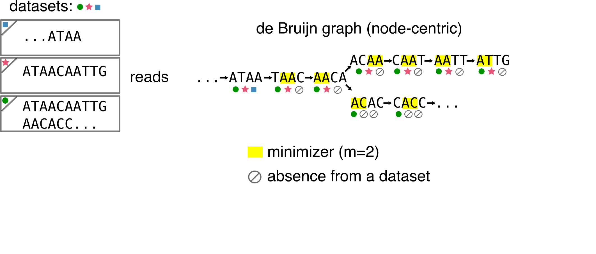

# First blog post: all about the -tigs!
Following a recent discussion on [Twitter](https://twitter.com/bioinfochat/status/1252912873698988035?s=20), I decided to do a high-level presentation of the population of -tigs sequences we encounter lately in k-mers related-papers (counting, assembly, indexing...). We attempted to briefly review some of them our [REINDEER paper](https://www.biorxiv.org/content/10.1101/2020.03.29.014159v2), though they deserve more space! I'll mostly cover unitigs, simplitigs and their twin USTs, monotigs, omnitigs but also very related sequences such as super-k-mers. 

**Disclaimer:** my goal here is not to formally present the different types of sequences, since such information can be found in the related articles. However, if you find a mistake, I'll be glad to have an opportunity to amend the document!

## Introduction
I'll assume you know what's a de Bruijn graph and k-mers in the following. In the following figure all the concepts we will need are present:

You'll see that I'll often write down the number of nucleotides of a representation.
It is because a lot of -tigs are related to the concept of **_spectrum preserving string sets_** (SPSS), that was [recently described](https://www.biorxiv.org/content/10.1101/2020.01.07.896928v2) in the context of sequence indexation.
Basically, a SPSS built over a set of k-mers preserves all the k-mer sequences. The most obvious SPSS is the k-mer set itself.

Most SPSS do not handle multiplicity. Thus, they preserve a set of k-mers, but not a multiset. There is one exception that is presented in the following.

## Unitigs: the old classic
Simply put, unitigs are maximal simple paths in the de Bruijn graph. See an exemple in the following:

In assembly, unitigs are considered as safe sequences because you can assemble their k-mers without ambiguity. When an ambiguity happens, the unitig is stopped and another starts. These sequences are often output during the inner steps of an assembler, before being further elongated into contigs.

Something that should be noticed from unitigs: they are a SPSS. You can retrieve the original set of k-mers, given a set of unitigs. At worst they use as much nucleotides to represent the k-mer set as the k-mer set itself, but usually, they represent it in a more compacted and efficient way.

Sometimes you will encounter the term **unitig graph** or **compacted de Bruijn graph** (such as [here](https://www.ncbi.nlm.nih.gov/pubmed/27307618)). They denote the graph for which the set of nodes is the set of unitigs computed from the k-mers, and with edges remaining the same k-1 overlaps as in the original de Bruijn graph (for the node-centric definition).

## Simplitigs and USTs: harder better longer longer

## Monotigs: keep the counts

## Omnitigs (and contigs): buckle up for assembly 

## Disjointings
