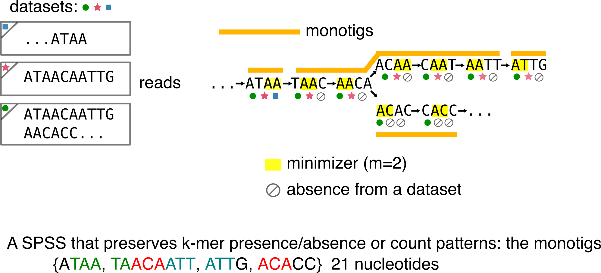
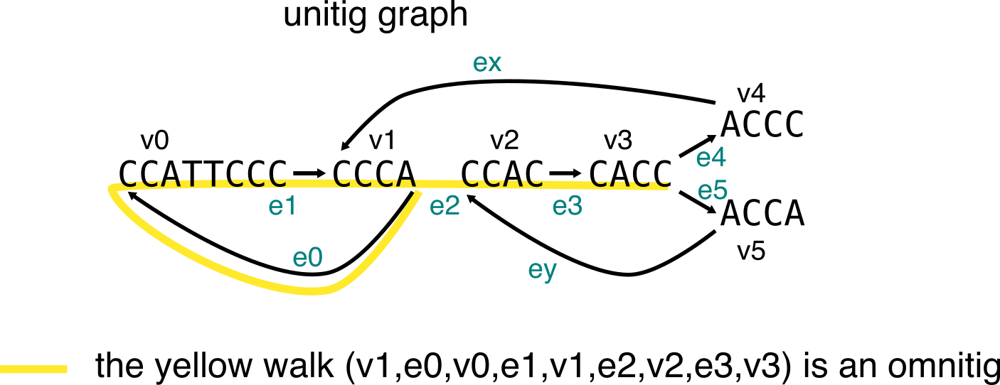
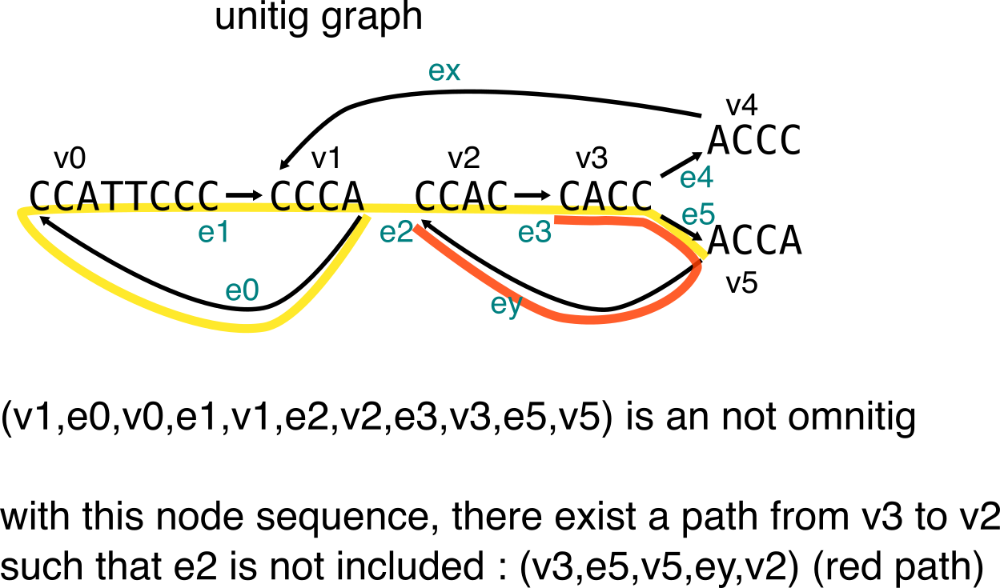
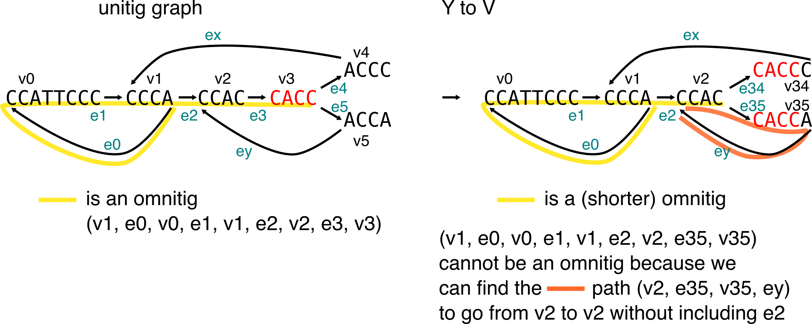

---	
layout: default
---

# Sneak peek at the -tigs!

23 april 2020

Following a recent discussion on [Twitter](https://twitter.com/bioinfochat/status/1252912873698988035?s=20), I decided to do a (very) high-level presentation of the population of -tigs sequences we encounter lately in k-mers related-papers (counting, assembly, indexing...). Since I contributed to a new -tig myself, we attempted to briefly review some of them our REINDEER paper [[1]](https://www.biorxiv.org/content/10.1101/2020.03.29.014159v2), though they deserve more space! I'll mostly cover unitigs, simplitigs and their twin USTs, monotigs, omnitigs but also very related sequences such as super-k-mers. 

**Disclaimer:** my goal here is not to formally present the different types of sequences, nor to be exhaustive, since such information can be found in the related articles. However, if you find a mistake, I'll be glad to have an opportunity to amend the document!

Table of content:

  * [Introduction](#introduction)
  * [Unitigs](#unitigs-the-old-classic)
  * [Simplitigs, USTs](#simplitigs-and-usts-harder-better-longer-longer)
  * [Monotigs](#monotigs-do-the-accounts)
    + [Super-k-mers of unitigs](#super-k-mers-of-unitigs)
    + [Super k-mers of reads](#super-k-mers-of-reads)
    + [Monotigs](#monotigs)
  * [Omnitigs, contigs, macrotigs](#omnitigs-and-contigs-and-macrotigs-buckle-up-for-more-assembly)
    + [Y to V operation](#y-to-v-operation)
    + [Omnitigs](#omnitigs)
    + [Macrotigs](#macrotigs)
  * [Disjointings](#disjointings-leaving-the-de-bruijn-world)
  * [References](#references)

## Introduction
I'll assume you know what's a de Bruijn graph and k-mer. In the following figure all the concepts we will need are present. Let's assume we deal with 3 datasets (shown using colored circle/star/square), two of them contain a single read, one of them contains two reads. We can build the de Bruijn graph from those reads (k=4). Remember that only distinct k-mers are present in the de Bruijn graph, so multiplicities are lost.

Other needed concepts:

* **Minimizers [[2]](https://academic.oup.com/bioinformatics/article/20/18/3363/202143)** There exist several definitions. Here it we be sufficient to consider a minimizer as the smallest l-mer that appears within a k-mer, with l < k. In the example figures I'll use a size (m) of 2, and we will assume we compute minimizers using the lexicographic order.
* K-mer **presence/absence** in datasets. Under each k-mer I represent whether it is present or not in each of the three datasets using the circle/star/square or an "empty set" symbol if they are absent.
* A **compaction** is the operation through which two nodes u->v are fused in a single one, by taking all nucleotides from u and adding the last nucleotide of v, the edge e=(u,v) is removed (example: ATTC->TTCA is compacted in ATTCA).

You'll see that I'll often write down the number of nucleotides of a representation.
It is because a lot of -tigs are related to the concept of **_spectrum preserving string sets_** (SPSS), that was recently described [[3]](https://www.biorxiv.org/content/10.1101/2020.01.07.896928v2) in the context of sequence indexation.
Basically, a SPSS built over a set of k-mers preserves all the k-mer sequences. The most obvious SPSS is the k-mer set itself.

Most SPSS do not handle multiplicity. Thus, they preserve a set of k-mers, but not a multiset. There is one exception that is presented in the following.

## Unitigs: the old classic
Simply put, unitigs are maximal simple paths in the de Bruijn graph. See an exemple in the following:

In assembly, unitigs are considered as safe sequences because you can assemble their k-mers without ambiguity. When an ambiguity happens, the unitig is stopped and other ones start. These sequences are often output during the inner steps of an assembler, before being further elongated into contigs.

Something that should be noticed from unitigs: they are a SPSS. You can retrieve the original set of k-mers, given a set of unitigs. At worst they use as much nucleotides to represent the k-mer set as the k-mer set itself, but usually, they represent it in a more compacted and efficient way (here we used 18 nucleotides in comparison to the 28 of the k-mer set).

In order to discuss the next -tig, notice the red substring that shows some redundancy that remains in the representation. This is because unitigs still share a k-1 overlap.
Also keep in mind that for the sake of simplicity I used very small k-mers, but that the burden of redundancy increases with real-life-sized k-mers.

Sometimes you will encounter the term **unitig graph** or **compacted de Bruijn graph** (such as [[4]](https://www.ncbi.nlm.nih.gov/pubmed/27307618)). They denote the graph for which the set of nodes is the set of unitigs computed from the k-mers, and with edges remaining the same k-1 overlaps as in the original de Bruijn graph (for the node-centric definition). The graph in the above figure is one of those. 

Unitigs are obviously used in assembly context [[4]](https://www.ncbi.nlm.nih.gov/pubmed/27307618), but also, thanks to the k-mer set compaction, motivated indexation works such as [[5]](https://academic.oup.com/bioinformatics/article/34/13/i169/5045749). I use [this tool](https://github.com/GATB/bcalm) when I need to build unitigs.

## Simplitigs and USTs: harder better longer longer

Keeping up with the idea of SPSS, and of representing the k-mer set while minimizing the number of nucleotides, can we do better than unitigs? Sure, if we drop the "non-ambiguously-assembled-sequences" criterion. Two papers [[6]](https://www.biorxiv.org/content/10.1101/2020.01.12.903443v1.full) for simplitigs and [[3]](https://www.biorxiv.org/content/10.1101/2020.01.07.896928v2) for USTs  described a solution simultaneously, though independently.

The intuition is that unitigs can be compacted to obtain longer sequences and reduce the number of k-1 redundancies. Both papers propose a greedy algorithm to achieve that. See the example below:

From the below example, one can be tempted to think that all compactions are equivalent. Let me show you an example where it is not the case. Compare this first compaction choice (in particular the number of nucleotides):

To this second one:

Given the number of used nucleotides for the representation, the second one is more economical.

You can build UST using the code from that [repo](https://github.com/medvedevgroup/UST/blob/master/README.md), and simplitigs are available [here](https://github.com/prophyle/prophasm).

## Monotigs: do the accounts

Let's get back to the introduction figure and consider the k-mer presence/absence in the graph. It is very easy to notice that unitigs can contain k-mers that have different presence/absence profiles. For instance the leftmost unitig ATAACA contains k-mers present in all three datasets and k-mers not present in the square dataset.

Monotigs were introduced in [[1]](https://www.biorxiv.org/content/10.1101/2020.03.29.014159v2) in order to create SPSS that also guarantee that all k-mers in a sequence of the SPSS have the same presence/absence profile.

But first, I need to introduce another SPSS with no -tig suffix, the super-k-mers.

### Super-k-mers of unitigs
Super-k-mers of unitigs are substring from unitigs.
They are built by compacting all consecutive k-mers of a unitig that share a similar minimizer.
Observe that these super-k-mers are also a SPSS. However, just as unitigs, it is not guaranteed that all k-mers have the same presence/absence pattern.

Super-k-mers of unitigs are often less efficient than unitigs in terms of nucleotide minimization to represent the set of k-mers, however they are handy when you need to partition a set of k-mers. Thus, with a wisely chosen minimizer scheme (in real life, we do not only use lexicographic order), one can dispatch k-mers in balanced buckets per minimizer. For an example of this usage, see [[7]](https://www.biorxiv.org/content/10.1101/546309v2).

### Super k-mers of reads
Historically, they were the first super-k-mers [[8]](https://arxiv.org/abs/1505.06550) to be introduced. They differ from the super-k-mers of unitigs since they are built from the read sequences:

Notice that, unlike the other sequences we've reviewed, here the initial multiset of k-mers is represented in a SPSS.

### Monotigs

In REINDEER, a colored de Bruijn graph implementation, we relied on super-k-mers of unitigs for our indexation strategy. However, we were not happy with the incapacity of super-k-mers to guarantee that k-mers have the same presence/absence pattern. Thus, we needed this property to properly report the k-mers colors in REINDEER. Thus we introduced monotigs.
Monotigs are compactions of consecutive k-mers in a de Bruijn graph, such that these k-mers share the same minimzer **and** the same presence/absence pattern.

Observe that despite being consecutive with TAAC and sharing the AA minimizer, ATAA is its own monotig because it is the only one to be present in the square dataset.
Conversely, AATT and ATTG have the same presence/absence pattern, but different minimizers so the monotigs are different.

More precisely, monotigs require that k-mers have the same count pattern over datasets. For instance, imagine that the circle symbol means: seen 10 times in green dataset and the star means: seen 50 times in the pink dataset. With that scheme REINDEER can output k-mers or sequences quantifications over a collection of datasets.

## Omnitigs (and contigs) and macrotigs: buckle up for more assembly 

We leave the SPSS realm in this section, but we continue to review the -tig sequences.
Omnitigs were described in the context of assembly. Their motivation is to represent a "safe" set of sequences, i.e. that will be found in any assembly solution from a de Bruijn graph. In short, when compacting unitigs in so-called contigs, the assembler has to make choices at ambiguous bifurcations. Omnitigs will be found in any contig set that is solution of an assembly graph, regardless of the compaction choices.
But first, I'll introduce a way to compact the graph that does most of the work, according to the omnitig papers [[9]](https://www.ncbi.nlm.nih.gov/pubmed/27749096) and [[10]](https://drops.dagstuhl.de/opus/volltexte/2017/7342/).

### Y to V operation

Let's focus on bifurcations in de Bruijn graphs. In simple case like the following, the two child nodes have a single, unambiguous parent. Y to V operation proposes to duplicate the content of this parent node and to compact it to the children.

In this example the red node is duplicated in the two children nodes. ATAACAATT and ATAACAACG are two "safe" sequences that will be found in contigs.
I said Y to V do _almost_ all the work, because sometimes they prevent finding the longest "safe" sequences, so the operation is not always optimal. That's why omnitigs are introduced.

### Omnitigs 

In a graph, omnitigs (in their edge-centric definition) are a walk from node v0 to node vn (with edge ei from vi-1 to vi), such that for all 1<= i <= j <= n-1, there is no path that allows to go from vj to vi without having ej+1 as first edge, and ei as last edge. To illustrate this, I'll use two examples inspired from the paper, one shows a walk that **is** an omnitig, the second shows a walk that **is not** an omnitig.

To describe the longest "safe" sequences from contigs, one can compute the set of maximal omnitigs.
Finally, we'll see how the Y to V operation is sometimes not enough, and can prevent from finding the maximal omnitigs in a graph.

### Macrotigs
Macrotigs recently introduced [[11]](https://arxiv.org/pdf/2002.10498.pdf) a nice way to compute maximal omnitigs in O(m) time, with m the number of edges in the graph.

## Disjointings: leaving the de Bruijn world
I'm new to them! I first noticed them as they were mentionned [here](https://twitter.com/bioinfochat/status/1252912940384165889?s=20). It seems their spirit can be compared to simplitigs/UST, but they are defined on another type of assembly graph, the overlap graph, and the compaction algorithm is different [[12]](https://www.nature.com/articles/s41587-019-0072-8).

## References
About SPSS
* [[3]](https://www.biorxiv.org/content/10.1101/2020.01.07.896928v2) Representation of k-mer sets using spectrum-preserving string sets, Rahman et al., 2020 (**definition**)
* [[1]](https://www.biorxiv.org/content/10.1101/2020.03.29.014159v2) REINDEER: efficient indexing of k-mer presence and abundance in sequencing datasets, Marchet et al., 2020 (**overview**)

About unitigs
* [[4]](https://www.ncbi.nlm.nih.gov/pubmed/27307618) Compacting de Bruijn graphs from sequencing data quickly and in low memory, Chikhi et al., 2016 (**unitigs in assembly**)
* [[5]](https://academic.oup.com/bioinformatics/article/34/13/i169/5045749) A space and time-efficient index for the compacted colored de Bruijn graph, Almodaresi et al., 2018 (**unitigs in indexation**)

About simplitigs, USTs
* [[3]](https://www.biorxiv.org/content/10.1101/2020.01.07.896928v2) Representation of k-mer sets using spectrum-preserving string sets, Rahman et al., 2020 (**UST**)
* [[6]](https://www.biorxiv.org/content/10.1101/2020.01.12.903443v1.full) Simplitigs as an efficient and scalable representation of de Bruijn graphs, Brinda et al., 2020 (**simplitigs**)

About minimizers, super-k-mers
* [[2]](https://academic.oup.com/bioinformatics/article/20/18/3363/202143) Reducing storage requirements for biological sequence comparison, Roberts et al., 2004 (**minimizers**)
* [[8]](https://arxiv.org/abs/1505.06550) MSPKmerCounter: A Fast and Memory Efficient Approach for K-mer Counting, Li and Yan, 2015 (**super-k-mers of reads**)
* [[7]](https://www.biorxiv.org/content/10.1101/546309v2) Indexing De Bruijn graphs with minimizers, Marchet et al., 2019 (**super-kmer-mers of unitigs for indexation**)

About monotigs
* [[1]](https://www.biorxiv.org/content/10.1101/2020.03.29.014159v2) REINDEER: efficient indexing of k-mer presence and abundance in sequencing datasets, Marchet et al. 2020 (**definition**)

About omnitigs, macrotigs
* [[9]](https://www.ncbi.nlm.nih.gov/pubmed/27749096) Safe and Complete Contig Assembly Through Omnitigs, Tomescu et al., 2017 (**omnitigs**)
* [[10]](https://drops.dagstuhl.de/opus/volltexte/2017/7342/) Optimal Omnitig Listing for Safe and Complete Contig Assembly, Cairo et al., 2017 (**omnitigs**)
* [[11]](https://arxiv.org/pdf/2002.10498.pdf) From omnitigs to macrotigs: a linear-time algorithm for safe walks – common to all closed arc-coverings of a directed graph, Cairo et al., 2020 (**macrotigs**)

About disjointigs
* [[12]](https://www.nature.com/articles/s41587-019-0072-8) Assembly of Long Error-Prone Reads Using Repeat Graphs, Kolmogorov et al., 2019 (**in the long read assembler Flye**)

**Thanks** [@RayanChikhi](https://twitter.com/RayanChikhi) and [@BQPMalfoy](https://twitter.com/BQPMalfoy) for discussing these topics with me and for your feedback!
