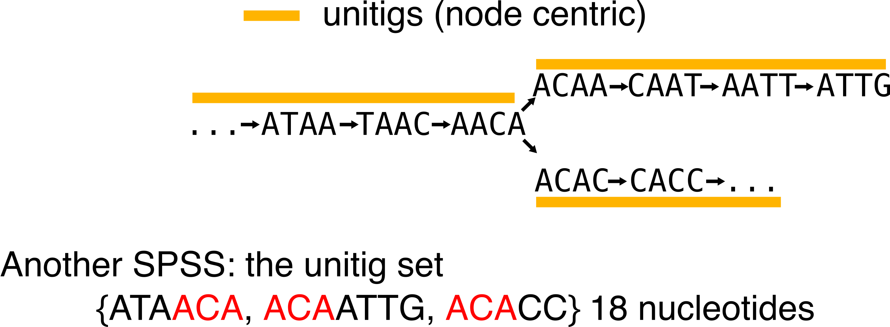
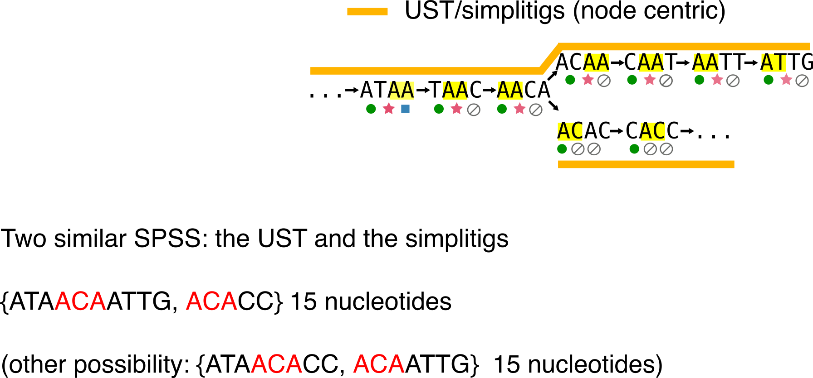
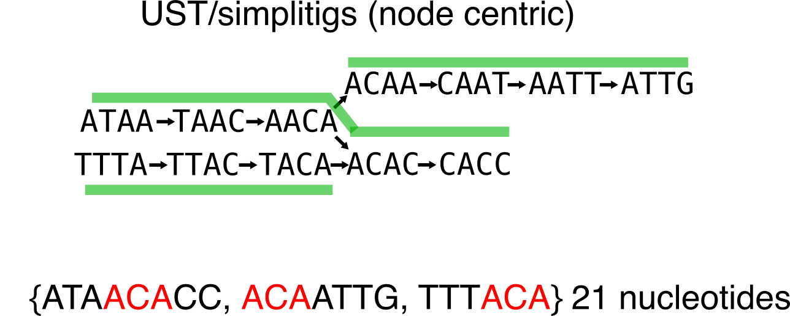
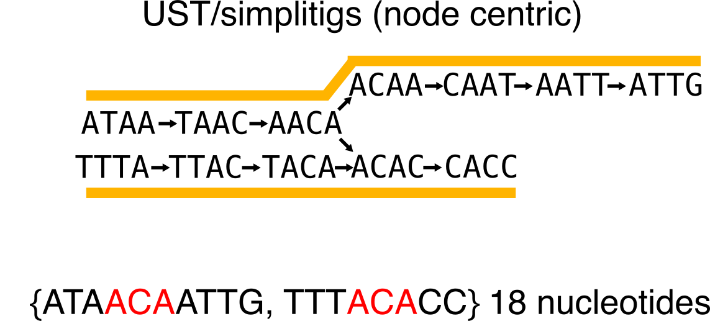
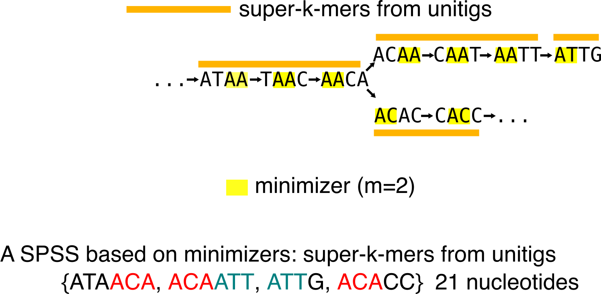
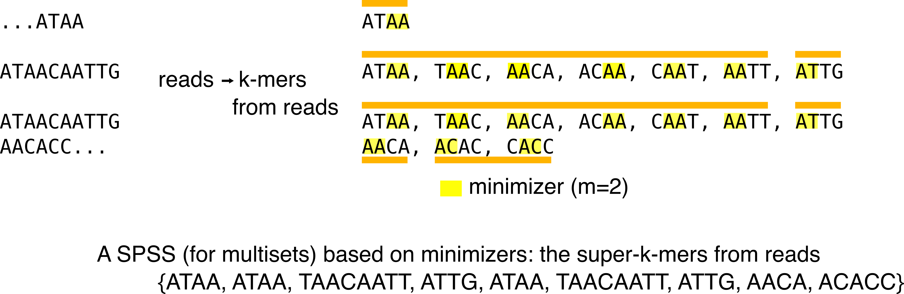

# First blog post: sneak peek at the -tigs!
Following a recent discussion on [Twitter](https://twitter.com/bioinfochat/status/1252912873698988035?s=20), I decided to do a high-level presentation of the population of -tigs sequences we encounter lately in k-mers related-papers (counting, assembly, indexing...). We attempted to briefly review some of them our [REINDEER paper](https://www.biorxiv.org/content/10.1101/2020.03.29.014159v2), though they deserve more space! I'll mostly cover unitigs, simplitigs and their twin USTs, monotigs, omnitigs but also very related sequences such as super-k-mers. 

**Disclaimer:** my goal here is not to formally present the different types of sequences, since such information can be found in the related articles. However, if you find a mistake, I'll be glad to have an opportunity to amend the document!

## Introduction
I'll assume you know what's a de Bruijn graph and k-mers in the following. In the following figure all the concepts we will need are present. Let's assume we deal with 3 datasets (shown using colored circle/star/square), two of them contain a single read, one of them contains two reads. We can build the de Bruijn graph from those reads (k=4). Remember that only distinct k-mers are present in the de Bruijn graph, so multiplicities are lost.

Other needed concepts:

* **Minimizers.** There exist several definition. Here it we be sufficient to consider a minimizer as the smallest l-mer that appears within a k-mer, with l < k. In examples I'll use a a size (m) of 2, and we will assume we compute minimizers using the lexicographic order.
* K-mer **presence/absence** in datasets. Under each k-mer I represent whether it is present or not in each of the three datasets using the circle/star/square or an "empty set" symbol if they are absent.
* A **compaction** is the operation through which two nodes u->v are fused in a single one, by taking all nucleotides from u and adding the last nucleotide of v, the edge e=(u,v) is removed (example: ATTC->TTCA is compacted in ATTCA).

You'll see that I'll often write down the number of nucleotides of a representation.
It is because a lot of -tigs are related to the concept of **_spectrum preserving string sets_** (SPSS), that was [recently described](https://www.biorxiv.org/content/10.1101/2020.01.07.896928v2) in the context of sequence indexation.
Basically, a SPSS built over a set of k-mers preserves all the k-mer sequences. The most obvious SPSS is the k-mer set itself.

Most SPSS do not handle multiplicity. Thus, they preserve a set of k-mers, but not a multiset. There is one exception that is presented in the following.

## Unitigs: the old classic
Simply put, unitigs are maximal simple paths in the de Bruijn graph. See an exemple in the following:

In assembly, unitigs are considered as safe sequences because you can assemble their k-mers without ambiguity. When an ambiguity happens, the unitig is stopped and another starts. These sequences are often output during the inner steps of an assembler, before being further elongated into contigs.

Something that should be noticed from unitigs: they are a SPSS. You can retrieve the original set of k-mers, given a set of unitigs. At worst they use as much nucleotides to represent the k-mer set as the k-mer set itself, but usually, they represent it in a more compacted and efficient way (here we used 18 nucleotides in comparison to the 28 of the k-mer set).

In order to discuss the next -tig, notice the red substring that shows some redundance that remains in the representation. This is because unitigs still share a k-1 overlap.
Also keep in mind that for the sake of simplicity I used very small k-mers, but that the burden of redundancy increases with real-life-sized k-mers.

Sometimes you will encounter the term **unitig graph** or **compacted de Bruijn graph** (such as [here](https://www.ncbi.nlm.nih.gov/pubmed/27307618)). They denote the graph for which the set of nodes is the set of unitigs computed from the k-mers, and with edges remaining the same k-1 overlaps as in the original de Bruijn graph (for the node-centric definition). The graph in the above figure is one of those. 

## Simplitigs and USTs: harder better longer longer

Keeping up with the idea of SPSS, and of representing the k-mer set while minimizing the number of nucleotides, can we do better than unitigs? Sure, if we drop the "non-ambiguously-assembled-sequences" criterion. Two papers [here for simplitigs](https://www.biorxiv.org/content/10.1101/2020.01.12.903443v1.full) and [here for USTs](https://www.biorxiv.org/content/10.1101/2020.01.07.896928v2) described a solution simultaneously, though independantly.

The intuition is that unitigs can be compacted to obtain longer sequences and reduce the number of k-1 redundances. Both paper proposes a greedy algorithm to achieve that. See the example below:

From the below example, one can be tempted to think that all compactions are equivalent. Let me show you an example where it is not the case. Compare this first compaction choice (in particular the number of nucleotides):

To this second one:

You can build UST using the code from that [repo](https://github.com/medvedevgroup/UST/blob/master/README.md), and simplitigs are available [here](https://github.com/prophyle/prophasm).

## Monotigs: do the (ac)counts

Let's get back to the introduction figure and consider the k-mer presence/absence in the graph. It is very easy to notice that unitigs can contain k-mers that have different presence/absence profiles. For instance the leftmost unitig ATAACA contains k-mers present in all three datasets and k-mers not present in the square dataset.

Monotigs were [introduced](https://www.biorxiv.org/content/10.1101/2020.03.29.014159v2) in order to create SPSS that also guarantee that all k-mers in a sequence of the SPSS have the same presence/absence profile.

But first, I need to introduce another SPSS with no -tig suffix, the super-k-mers.

### Super-k-mers of unitigs
Super-k-mers of unitigs are substring from unitigs.
They are built by compacting all consecutive k-mers of a unitig that share a similar minimizer.
Observe that these super-k-mers are also a SPSS. However, just as unitigs, it is not guaranteed that all k-mers have the same presence/absence pattern.

Super-k-mers of unitigs are often less efficient than unitigs in terms of nucleotide minimization to represent the set of k-mers, however they are handy when you need to partition a set of k-mer. Thus, with a wisely chosen minimizer scheme (in real life, we do not only use lexicographic order), one can dispatch k-mers in buckets per minimizer. For an example of this usage, see [this work](https://www.biorxiv.org/content/10.1101/546309v2).

### Super k-mers of reads
Historically, they were the [first super-k-mers](https://www.ncbi.nlm.nih.gov/pubmed/25609798) to be introduced. They differ from the super-k-mers of unitigs since they are built from the read sequences:

## Omnitigs (and contigs): buckle up for more assembly 

## Disjointings: leaving the de Bruijn world
